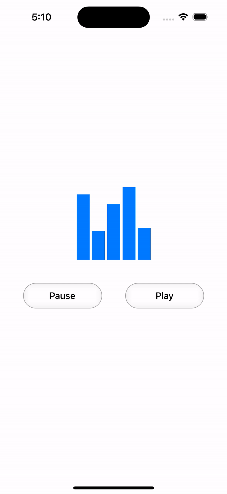

# SoundWaveVisualizer


**EqualizerView** is a custom iOS UIView component that simulates a dynamic equalizer animation. It allows you to display multiple bars representing an audio equalizer, with visual states for play, pause, and stop, along with customizable bar count and spacing. This view can be used in music or audio-related apps to provide users with a visual representation of sound.

<div align="center">
  
</div>

## Features

- Customizable number of bars (`barCount`).
- Adjustable space between bars (`barSpacing`).
- Supports three visual states: Play, Pause, and Stop.
- Smooth animations with the option for animation control (`animated` flag).
- Can be easily integrated into your app's UI.
- Automatically adjusts the view based on app state when entering the foreground.

## Installation

This is an Xcode project, so you can directly clone or download the project into your workspace.

### Clone the Repository

```bash
git clone https://github.com/jaydeep-godhani/SoundWaveVisualizer.git
```
Alternatively, you can download the project as a ZIP file from the GitHub repository page.

### Integrating into Your Project

To integrate the `EqualizerView` into your own Xcode project:

1. Download or clone the repository.
2. Copy the `EqualizerView.swift` file into your project.
3. Add `EqualizerView` to your storyboard or use it programmatically in your view controllers.

## Usage

### Step 1: Add `EqualizerView` to your storyboard or XIB file
You can use the `EqualizerView` as a custom view in your storyboard or XIB file. Make sure to set the class to `EqualizerView` and customize the properties like `barCount` and `barSpacing` from the Attributes inspector.

### Step 2: Programmatic Usage
You can also initialize `EqualizerView` programmatically.
```swift
let equalizerView = EqualizerView(frame: CGRect(x: 0, y: 0, width: 300, height: 100))
equalizerView.barCount = 5
equalizerView.barSpacing = 2.0
equalizerView.tintColor = .blue
view.addSubview(equalizerView)
```

### Step 3: Update the State
Use the `setState(_:animated:)` method to update the visual state of the equalizer.
```swift
equalizerView.setState(.play, animated: true)  // Start the animation
equalizerView.setState(.pause, animated: true) // Pause the animation
equalizerView.setState(.stop, animated: true)  // Stop the animation
```

## Customization

- **barCount**: Set the number of bars to be drawn in the equalizer.
- **barSpacing**: Adjust the spacing between bars.
- **tintColor**: Set the color of the bars (supports dynamic tinting).
- **State Management**: Control the animation states using `.play`, `.pause`, and `.stop`.

## App State Awareness

The `EqualizerView` is aware of the app's state. When the app enters the foreground, the visual state of the equalizer will be updated to match its current state.

## Contributions

We welcome contributions! If you find a bug, have an idea for a new extension, or want to improve the documentation, feel free to fork the repo and create a pull request.

## License

This project is licensed under the MIT License - see the `LICENSE` file for details.
